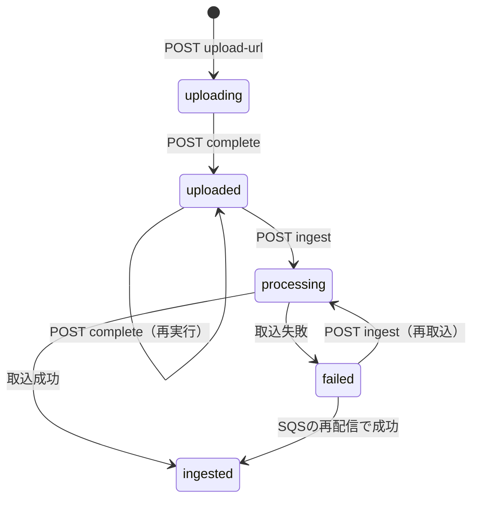

# API設計書

- 親ドキュメント: [architecture.md](./architecture.md)

本ドキュメントでは、architecture.mdにおけるバックエンドAPIの詳細仕様を定義する。認証の詳細は[authorization.md](./authorization.md)に、各設計判断の理由は[ADR](./adr/)に記載している。

## 目次

- [1. 概要](#1-概要)
- [2. 共通仕様](#2-共通仕様)
- [3. エンドポイント一覧](#3-エンドポイント一覧)
- [4. リソースモデル](#4-リソースモデル)
- [5. エンドポイント詳細](#5-エンドポイント詳細)
- [6. SSE仕様](#6-sse仕様)
- [7. 複数APIの呼び出し順序](#7-複数apiの呼び出し順序)
- [8. 既知の制約・未対応事項](#8-既知の制約未対応事項)

## 1. 概要

### 1.1 目的と対象範囲

本ドキュメントは、SPAが呼び出すバックエンドAPIの仕様を、呼び出し側から見た契約として定義する。対象は、api-fnとchat-fnが公開するFastAPIのルート（`/api`配下の全20エンドポイント）である。

以下は対象外とする。ただし、APIと組み合わせて使う手順は7章で扱う。

- Cognitoの認可・トークンエンドポイント。api-fnが呼び出し、SPAからは呼ばない（[authorization.md](./authorization.md)）
- 署名付きURLによるS3への直接アクセス
- api-fnからingest-fnへ渡すSQSメッセージ（内部の契約であり、SPAからは見えない）

FastAPIはOpenAPI定義を自動生成するが、本番環境では公開していない（[8章](#8-既知の制約未対応事項)）。また、OpenAPIからわかるのはパス、型、必須項目までである。そのため本ドキュメントでは、操作できるデータの範囲、エラーになる条件、冪等性、SSEの内容など、OpenAPIでは表せない仕様を中心に記述する。

### 1.2 設計方針

- **同一オリジンで配信する**：APIはSPAと同じドメインの`/api`配下でCloudFrontから配信する。そのため、CORSの設定を持たない。
- **トークンはHttpOnly Cookieで扱う**：バックエンドはCognitoとの間で認可コードの交換とトークンの更新・失効を行い、トークンをHttpOnly Cookieとしてブラウザへ返す。パスワードの管理やトークンの発行は行わない（[ADR-0018](./adr/0018-token-storage-httponly-cookie.md)）。
- **閲覧は全員、変更は本人のみ**：社内のナレッジ共有を目的とするため、チャット、ドキュメント、プロフィールは認証済みの全ユーザーが閲覧できる。一方で、ドキュメントの完了登録、取込、削除は登録したユーザー本人に限る。
- **ファイルはLambdaを経由しない**：アップロードと閲覧は署名付きURLでS3へ直接行い、APIはURLの発行と状態管理だけを担う（[ADR-0007](./adr/0007-upload-ingest-separation.md)）。
- **一覧は要約、詳細は全部**：一覧APIは要約だけを返し、試行ごとの出力のような大きなデータは詳細APIでだけ返す。
- **エラー形式はFastAPIの既定に従う**：独自のエラー形式は定義しない（[2.5](#25-エラーレスポンス)）。

## 2. 共通仕様

### 2.1 ベースURLと配信経路

ベースURLは`https://rag.business-efficiency.pro/api`である。リクエストは次の経路でFastAPIへ届く。

```text
SPA ─▶ CloudFront ─▶ API Gateway（REST、ステージ prod）─▶ Lambda（Lambda Web Adapter）─▶ FastAPI
```

ルーティングは二段階で行う。API GatewayはどちらのLambdaへ渡すかだけを決め、Lambdaプロキシ統合でパス全体をFastAPIへ渡す。どの関数で処理するかはFastAPIが決める。

| API Gatewayのリソース | メソッド | 統合先 | オーソライザ |
|------|------|------|------|
| `/api/health` | GET | api-fn | なし |
| `/api/auth/{proxy+}` | ANY | api-fn | なし |
| `/api/chats/stream` | POST | chat-fn | あり |
| `/api/chats` | ANY | api-fn | あり |
| `/api/chats/{proxy+}` | ANY | api-fn | あり |
| `/api/{proxy+}` | ANY | api-fn | あり |

API Gatewayは、グリーディパス（`{proxy+}`）より具体的なリソースを優先して照合する。そのため、`/api/chats/stream`だけがchat-fnへ渡り、`/api/users/...`や`/api/documents/...`は`/api/{proxy+}`で受けてapi-fnへ渡る。リソース定義の背景はarchitecture.mdの[9.3](./architecture.md#93-api-gateway)に記載している。

CloudFrontはAPI向けのビヘイビアでキャッシュを無効化し、`Host`を除く全てのヘッダーとCookieをオリジンへ転送する。また、viewer-requestのCloudFront Functionで、Cookieのアクセストークンを`Authorization`ヘッダーへ写す（[2.2](#22-認証)）。

タイムアウトは関数によって異なる。

| 対象 | 上限 | 超えたときの挙動 |
|------|------|------|
| api-fnのルート | 29秒（API Gatewayの統合タイムアウト） | API Gatewayが504を返す |
| `POST /api/chats/stream` | ストリーム全体で300秒 | ストリームが途中で切れる（[6.5](#65-異常系)） |
| `POST /api/chats/stream` | イベント間の無通信60秒（CloudFront） | 同上 |

末尾にスラッシュを付けたパス（`/api/health/`など）は、リダイレクトせずに404を返す。FastAPIの既定では307でスラッシュ無しのパスへ誘導するが、そのLocationヘッダーにはAPI Gatewayのexecute-apiドメインが入ってしまう。オリジンのドメインをクライアントへ露出させないため、自動リダイレクトを無効化している。

### 2.2 認証

`/api/health`と`/api/auth/*`を除く全エンドポイントで、アクセストークンを必須とする。IDトークンは受け付けない。トークンの取得と更新は[5.2](#52-認証)のエンドポイントで行い、詳細は[authorization.md](./authorization.md)に従う。

アクセストークンは、ブラウザが`__Host-access_token` Cookieとして自動で送る。API GatewayのオーソライザはCookieを読めないため、CloudFront FunctionがCookieの値を`Authorization: Bearer <アクセストークン>`へ写す。ただし、リクエストが既に`Authorization`ヘッダーを持つ場合は書き換えない。CloudFrontを経由しないローカル開発では、FastAPIがCookieを直接読む。

トークンはAPI GatewayとFastAPIの二段階で検証する。

| 段階 | 検証内容 | 失敗時 |
|------|------|------|
| API Gateway（Cognitoオーソライザ） | `Authorization`ヘッダーのトークンの署名、有効期限、`openid`スコープの有無 | Lambdaを起動せずに401を返す |
| FastAPI（`app/auth.py`） | `Authorization`ヘッダー、無ければCookieのトークンについて、JWKSによる署名、`iss`、`exp`、`token_use=access`、`client_id` | 401を返す |

更新系のリクエスト（POST、PUT、PATCH、DELETE）が`Origin`ヘッダーを持ち、その値がアプリのオリジン（環境変数`APP_ORIGIN`）と異なる場合、FastAPIは403を返す。Cookieは自動で送られるため、別サイトから送らせたリクエストを拒否するCSRF対策である。`Origin`を持たないリクエストはブラウザ以外のクライアントからのものであり、拒否しない。

検証に通ると、FastAPIはトークンの`sub`クレームを呼び出したユーザーのIDとして使う。

認可（誰のデータを操作できるか）はAPI Gatewayでは判定せず、各エンドポイントで判定する。本人に限る操作では、`sub`とドキュメントの所有者が一致しない場合に、存在しない場合と同じ404を返す（[8章](#8-既知の制約未対応事項)）。

### 2.3 リクエスト・レスポンス形式

| 項目 | 仕様 |
|------|------|
| データ形式 | JSON（UTF-8）。SSEのみ`text/event-stream`（[6章](#6-sse仕様)） |
| フィールド命名 | camelCase。ただし、SSEの`update`イベントの`state`だけはsnake_caseである（[6.3](#63-updateイベントのstate)） |
| 日時形式 | ISO 8601、UTC、マイクロ秒付き。例：`2026-09-29T03:12:45.123456+00:00` |
| ID形式 | `documentId`と`chatId`はULID（26文字）。先頭がタイムスタンプのため、辞書順が作成順と一致する。`userId`はCognitoの`sub`（UUID形式） |
| 日付の区切り | チャットの利用回数のみJSTの日付で区切る（[2.7](#27-流量制御)） |

パスパラメータの形式（ULIDやUUIDであるか）は検証しない。形式が不正なIDは、存在しないIDと同じ扱いになる。

### 2.4 共通ヘッダー

| ヘッダー | 方向 | 内容 |
|----------|------|------|
| `Cookie` | リクエスト | ブラウザが自動で送る。`__Host-access_token`はAPI全体へ、`__Secure-refresh_token`と`__Secure-auth_tx`は`/api/auth/*`へだけ送られる |
| `Authorization` | リクエスト | `Bearer <アクセストークン>`。SPAは付けず、CloudFront FunctionがCookieから付与する。直接付けた場合はCookieより優先する |
| `Origin` | リクエスト | 更新系のリクエストでブラウザが付ける。アプリのオリジンと異なれば403になる |
| `Content-Type` | リクエスト | ボディを持つリクエストでは`application/json` |
| `X-Request-Id` | レスポンス | リクエストごとのID。LambdaのリクエストIDを使い、ログとX-Rayのトレースにも同じ値を付与する。障害調査では、この値でログを検索する |
| `Set-Cookie` | レスポンス | `/api/auth/*`のレスポンスでのみ、トークンを入れたCookieの発行と削除に使う |
| `WWW-Authenticate` | レスポンス | FastAPIが返す401にのみ付与する。値は`Bearer` |
| `Cache-Control` | レスポンス | SSEのレスポンスにのみ`no-cache`を付与する |

`X-Request-Id`は、FastAPIがレスポンスを返した場合にのみ付く。API Gatewayが返すエラー（401、429、504）と、FastAPIの想定外の例外による500には付かない。

### 2.5 エラーレスポンス

エラーのボディ形式は返却元によって異なる。

| 返却元 | ボディ |
|------|------|
| FastAPI（`HTTPException`） | `{"detail": "メッセージ"}`。`detail`は文字列 |
| FastAPI（バリデーションエラー） | `{"detail": [...]}`。`detail`はエラーの配列 |
| FastAPI（想定外の例外） | `Internal Server Error`（`text/plain`） |
| API Gateway | `{"message": "メッセージ"}` |

全エンドポイントに共通するエラーは次のとおりである。各エンドポイントの「エラー」には、これ以外の固有のエラーだけを記載する。

| ステータス | 返却元 | 発生条件 | ボディの例 |
|------------|--------|----------|------|
| 401 | API Gateway | アクセストークンのCookieも`Authorization`ヘッダーも無い、トークンの署名や有効期限が不正、`openid`スコープが無い | `{"message": "Unauthorized"}` |
| 401 | FastAPI | API Gatewayの検証は通ったが、`token_use`や`client_id`が一致しない（同じユーザープールの別アプリクライアントが発行したトークンなど） | `{"detail": "Invalid authentication credentials"}` |
| 403 | FastAPI | 更新系のリクエストの`Origin`がアプリのオリジンと異なる | `{"detail": "cross-origin request rejected"}` |
| 404 | FastAPI | 定義されていないパス | `{"detail": "Not Found"}` |
| 405 | FastAPI | パスは存在するが、メソッドが定義されていない | `{"detail": "Method Not Allowed"}` |
| 422 | FastAPI | パラメータやボディが型や制約を満たさない | 下記を参照 |
| 429 | API Gateway | ステージのスロットリング上限を超えた（[2.7](#27-流量制御)） | `{"message": "Too Many Requests"}` |
| 500 | FastAPI | 処理中の想定外の例外（AWSサービスの呼び出し失敗など） | `Internal Server Error` |
| 504 | API Gateway | api-fnの処理が29秒を超えた | `{"message": "Endpoint request timed out"}` |

422はFastAPIが自動で返すため、コードには記述が無い。パラメータやボディを持つ全エンドポイントが対象になる。`loc`で原因の位置を、`type`で違反した制約を示す。

```json
{
  "detail": [
    {
      "type": "less_than_equal",
      "loc": ["query", "limit"],
      "msg": "Input should be less than or equal to 100",
      "input": "101",
      "ctx": {"le": 100}
    }
  ]
}
```

### 2.6 件数制限

一覧を返す4つのエンドポイントは、クエリパラメータ`limit`で件数を指定する。

| 項目 | 仕様 |
|------|------|
| 範囲 | 1以上100以下。範囲外は422 |
| 既定値 | 50 |
| 並び順 | 新しい順（ULIDの降順） |
| ページング | なし。`limit`を超える古いデータは取得できない |

SPAは`limit`を指定しないため、各一覧は最新50件まで表示される。

### 2.7 流量制御

流量は2つの仕組みで制限する。どちらも上限を超えると429を返す。

| 仕組み | 対象 | 上限 | 返却元 |
|------|------|------|------|
| ステージのスロットリング | API Gatewayを通る全リクエスト | 定常20リクエスト/秒、バースト40。全ユーザーの合計に対する上限である | API Gateway |
| チャットの1日あたりの利用上限 | `POST /api/chats/stream`のみ | 1ユーザーあたり1日20回（環境変数`CHAT_DAILY_QUOTA`）。日付はJSTで区切る | FastAPI（chat-fn） |

スロットリングは短時間の集中を抑えるもので、通常の利用で上限に達する水準ではない。一方で、利用上限はBedrockの推論費用に上限を設けるためのものである（[ADR-0017](./adr/0017-chat-daily-quota.md)）。

クライアントは、2つの429をボディのキーで区別できる。API Gatewayのスロットリングは`message`を、利用上限は`detail`を持つ。利用状況は`GET /api/users/{user_id}/quota`で取得できる。

## 3. エンドポイント一覧

| No | メソッド | パス | 概要 | 実行関数 | 操作対象 |
|----|----------|------|------|----------|----------|
| 1 | GET | `/api/health` | ヘルスチェック | api-fn | なし（認証不要） |
| 2 | GET | `/api/auth/login` | Hosted UIへリダイレクトし、サインインを始める | api-fn | なし（アクセストークン不要） |
| 3 | GET | `/api/auth/callback` | 認可コードを交換し、トークンのCookieを発行する | api-fn | 本人のデータのみ（アクセストークン不要） |
| 4 | POST | `/api/auth/refresh` | アクセストークンを更新する | api-fn | 本人のデータのみ（アクセストークン不要） |
| 5 | POST | `/api/auth/logout` | トークンを失効させ、Cookieを削除する | api-fn | 本人のデータのみ（アクセストークン不要） |
| 6 | GET | `/api/users/me` | サインイン中のユーザーのプロフィールを取得する | api-fn | 本人のデータのみ |
| 7 | POST | `/api/users/me` | 表示名とメールアドレスをキャッシュする。切り替え前のSPAだけが呼ぶ | api-fn | 本人のデータのみ |
| 8 | GET | `/api/users/{user_id}` | プロフィールを取得する | api-fn | 全ユーザーのデータ |
| 9 | GET | `/api/users/{user_id}/quota` | 当日のチャット利用状況を取得する | api-fn | 全ユーザーのデータ |
| 10 | GET | `/api/users/{user_id}/documents` | 指定ユーザーのドキュメント一覧を取得する | api-fn | 全ユーザーのデータ |
| 11 | GET | `/api/users/{user_id}/chats` | 指定ユーザーのチャット一覧を取得する | api-fn | 全ユーザーのデータ |
| 12 | GET | `/api/documents` | 全ユーザーのドキュメント一覧を取得する | api-fn | 全ユーザーのデータ |
| 13 | POST | `/api/documents/upload-url` | ドキュメントを登録し、アップロード用URLを発行する | api-fn | 本人のデータのみ |
| 14 | POST | `/api/documents/{document_id}/complete` | アップロードの完了を登録する | api-fn | 本人のデータのみ |
| 15 | POST | `/api/documents/{document_id}/ingest` | 取込を開始する | api-fn | 本人のデータのみ |
| 16 | DELETE | `/api/documents/{document_id}` | ドキュメントを削除する | api-fn | 本人のデータのみ |
| 17 | GET | `/api/documents/{document_id}/download-url` | 閲覧用URLを発行する | api-fn | 全ユーザーのデータ |
| 18 | GET | `/api/chats` | 全ユーザーのチャット一覧を取得する | api-fn | 全ユーザーのデータ |
| 19 | GET | `/api/chats/{chat_id}` | チャットの詳細を取得する | api-fn | 全ユーザーのデータ |
| 20 | POST | `/api/chats/stream` | 質問を送信し、回答生成の進行をSSEで受け取る | chat-fn | 本人のデータのみ |

## 4. リソースモデル

APIが返すオブジェクトの定義である。5章の各エンドポイントは、ここで定義したモデルを参照する。DynamoDB上のキー（`PK`、`SK`など）はレスポンスに含めない。

### 4.1 ユーザー

#### UserProfile

DynamoDBに保存した、Cognitoのユーザー情報のキャッシュである。マスタはCognitoにあり、`POST /api/users/me`でのみ書き込む。

| フィールド | 型 | null許容 | 説明 |
|------------|----|----------|------|
| userId | string | 不可 | ユーザーの`sub` |
| displayName | string | 不可 | 表示名。SPAがIDトークンの`name`クレームから送信した値 |
| email | string | 不可 | メールアドレス。SPAがIDトークンの`email`クレームから送信した値 |
| createdAt | string | 不可 | 初めて`POST /api/users/me`が呼ばれた日時 |
| updatedAt | string | 不可 | 最後に`POST /api/users/me`が呼ばれた日時。SPAを読み込むたびに更新されるため、実質的には最後にSPAを開いた日時である |

#### Quota

| フィールド | 型 | null許容 | 説明 |
|------------|----|----------|------|
| limit | integer | 不可 | 1日あたりのチャット送信の上限回数 |
| used | integer | 不可 | 当日（JST）に消費した回数。`limit`を超えることはない |

### 4.2 ドキュメント

#### DocumentSummary

| フィールド | 型 | null許容 | 説明 |
|------------|----|----------|------|
| documentId | string | 不可 | ドキュメントID（ULID） |
| userId | string | 不可 | ドキュメントを登録したユーザーの`sub` |
| filename | string | 不可 | 登録時に指定したファイル名 |
| status | string | 不可 | ステータス。値は下記の表を参照 |
| createdAt | string | 不可 | 登録日時（アップロード用URLを発行した日時） |
| updatedAt | string | 不可 | 最後にステータスが変わった日時 |

#### DocumentListItem

DocumentSummaryに、次のフィールドを加えたものである。全ユーザーの一覧（`GET /api/documents`）だけが返す。

| フィールド | 型 | null許容 | 説明 |
|------------|----|----------|------|
| ownerName | string | 可 | 登録したユーザーの表示名。プロフィールが未登録の場合はnull |

#### ステータス

| 値 | 意味 |
|------|------|
| `uploading` | 登録済みだが、S3へのアップロード完了が登録されていない |
| `uploaded` | アップロードが完了した。まだ検索対象ではない |
| `processing` | 取込中。ingest-fnがテキスト抽出とベクトル登録を行っている |
| `ingested` | 取込が完了し、検索対象になった |
| `failed` | 取込に失敗した。再取込できる |

#### ステータス遷移



図に表していない遷移が2つある。

- **SQSへの送信失敗**：`POST ingest`は先に`processing`へ更新してからSQSへ送信する。送信に失敗した場合は、元のステータス（`uploaded`または`failed`）へ戻す（[ADR-0007](./adr/0007-upload-ingest-separation.md)）。
- **削除**：`processing`以外のどのステータスからでも削除できる。

ingest-fnは失敗時に`failed`へ更新したうえで例外を送出し、SQSに再配信させる（最大3回、超えるとDLQへ退避）。そのため、利用者が操作しなくても`failed`から`ingested`へ変わることがある。

### 4.3 チャット

1件のチャットは、1つの質問と、それに対する1〜2回の試行で構成する。回答の評価が`useful`でなければ1回だけ再試行するためである（architecture.mdの[7章](./architecture.md#7-ragパイプライン)）。

チャットは回答の生成が完了した時点でまとめて保存する。生成が途中で失敗した場合や、クライアントが切断した場合は保存しない。

#### ChatSummary

| フィールド | 型 | null許容 | 説明 |
|------------|----|----------|------|
| chatId | string | 不可 | チャットID（ULID）。質問を受け付けた時点で採番する |
| userId | string | 不可 | 質問したユーザーの`sub` |
| question | string | 不可 | 質問文 |
| finalAnswer | string | 可 | 最後の試行の回答 |
| finalGrade | string | 可 | 最後の試行の評価。値は下記の表を参照 |
| retryCount | integer | 不可 | 再試行した回数。0または1 |
| createdAt | string | 不可 | 回答を保存した日時（生成の完了時） |

一覧の並び順は`chatId`（質問を受け付けた順）で決まり、`createdAt`の順とは一致しないことがある。先に送った質問の生成が長引くと、`createdAt`は後に送った質問より遅くなるためである。

#### ChatListItem

ChatSummaryに`ownerName`（string、null可。質問したユーザーの表示名で、プロフィールが未登録の場合はnull）を加えたものである。全ユーザーの一覧（`GET /api/chats`）だけが返す。

#### ChatDetail

ChatSummaryに、次のフィールドを加えたものである。

| フィールド | 型 | null許容 | 説明 |
|------------|----|----------|------|
| attempts | ChatAttempt[] | 不可 | 試行ごとの出力。`attemptNo`の昇順 |

#### ChatAttempt

| フィールド | 型 | null許容 | 説明 |
|------------|----|----------|------|
| attemptNo | integer | 不可 | 試行番号。0始まり |
| queries | string[] | 不可 | 生成した検索クエリ（3〜5件） |
| documents | RetrievedDocument[] | 不可 | 検索とRerankを経て回答生成に使ったチャンク |
| answer | string | 可 | 回答 |
| grade | string | 可 | 回答の評価 |
| feedback | string | 可 | 評価の理由 |
| failureAnalysis | string | 可 | 失敗分析。再試行しても`useful`にならなかった場合に、最後の試行にだけ付く |

#### RetrievedDocument

| フィールド | 型 | null許容 | 説明 |
|------------|----|----------|------|
| documentId | string | 可 | チャンクの元になったドキュメントのID |
| filename | string | 可 | 元のファイル名。出典の表示に使う |
| text | string | 可 | チャンクの本文 |
| score | number | 可 | Rerankの関連度スコア。Rerankを通っていない場合はnull |

#### 評価（grade）

| 値 | 意味 |
|------|------|
| `useful` | 回答が正確で、質問に十分に答えている |
| `useless` | ハルシネーションは無いが、情報が不足している |
| `hallucination` | コンテキストに含まれない事実や誤りを含む |

## 5. エンドポイント詳細

### 5.1 ヘルスチェック

#### `GET /api/health`

| 項目 | 内容 |
|------|------|
| 概要 | FastAPIアプリケーションが起動し、リクエストに応答できることを確認する |
| 実行関数 | api-fn |
| 操作対象 | なし。トークンもCookieも要求しない唯一のエンドポイントである |
| 冪等性 | 冪等。副作用を持たない |

**リクエスト**

パラメータ、ボディともに持たない。`Authorization`ヘッダーも不要である。

**レスポンス**（`200 OK`）

| フィールド | 型 | null許容 | 説明 |
|------------|----|----------|------|
| status | string | 不可 | 常に`"ok"`を返す |

```json
{"status": "ok"}
```

**エラー**

固有のエラーは無い。認証を要求しないため、共通エラーのうち401は発生しない。

**備考**

- DynamoDBやS3などのAWSリソースにはアクセスしない。そのため、200が保証するのはCloudFrontからFastAPIまでの経路が通じていることだけであり、依存リソースの正常性は保証しない。
- AWSの設定値を必要としないため、ローカル環境でも環境変数を設定せずに応答する。

### 5.2 認証

本節のエンドポイントにはAPI Gatewayのオーソライザを適用しない。アクセストークンの期限が切れた状態で呼ばれるためである。代わりに、`/api/auth`をPathに持つCookieでリクエストを識別する。Cookieの属性は[authorization.md](./authorization.md)に記載している。

#### `GET /api/auth/login`

| 項目 | 内容 |
|------|------|
| 概要 | PKCEのcode_verifierとstateを生成し、Cognito Hosted UIの認可エンドポイントへリダイレクトする |
| 実行関数 | api-fn |
| 操作対象 | なし |
| 冪等性 | 冪等ではない。呼ぶたびに新しいstateとcode_verifierを生成し、`__Secure-auth_tx`を上書きする |

**リクエスト**

| 位置 | フィールド | 型 | 必須 | 制約 | 説明 |
|------|------------|----|------|------|------|
| query | returnTo | string | 任意 | `/`で始まり、`//`と`/\`で始まらないパス。それ以外は`/`に置き換える | サインイン後に戻る画面のパスとクエリ。既定値は`/` |

SPAはfetchではなく、ブラウザの画面遷移でこのURLを開く。

**レスポンス**（`302 Found`）

| 項目 | 内容 |
|------|------|
| `Location` | Hosted UIの`/oauth2/authorize`。`client_id`、`redirect_uri`、`scope=openid email profile`、`state`、`code_challenge`、`code_challenge_method=S256`を付ける |
| `Set-Cookie` | `__Secure-auth_tx`。state、code_verifier、`returnTo`をJSONにしてbase64urlで包んだ値。有効期限は10分 |

**エラー**

固有のエラーは無い。

**備考**

- `redirect_uri`は環境変数`APP_ORIGIN`から組み立て、リクエストの`Host`は使わない。CloudFrontがオリジンへ渡す`Host`はAPI Gatewayのドメインだからである。
- `returnTo`をパスに限るのは、サインイン後に外部サイトへ誘導されるオープンリダイレクトを防ぐためである。

#### `GET /api/auth/callback`

| 項目 | 内容 |
|------|------|
| 概要 | Hosted UIからのリダイレクトを受け取り、認可コードをトークンへ交換してCookieを発行する |
| 実行関数 | api-fn |
| 操作対象 | 本人のデータのみ。IDトークンの`sub`のプロフィールを更新する |
| 冪等性 | 冪等ではない。認可コードは1回しか交換できない |

**リクエスト**

| 位置 | フィールド | 型 | 必須 | 制約 | 説明 |
|------|------------|----|------|------|------|
| query | code | string | 必須 | なし | Cognitoが発行した認可コード |
| query | state | string | 必須 | `__Secure-auth_tx`のstateと一致する | `GET /api/auth/login`で生成したstate |
| query | error | string | 任意 | なし | Cognitoがサインインを拒否した場合に付く |
| cookie | `__Secure-auth_tx` | string | 必須 | なし | `GET /api/auth/login`が発行したCookie |

Cognitoがリダイレクトで呼び出すため、SPAから直接呼ぶことはない。

**レスポンス**（`302 Found`）

| 項目 | 内容 |
|------|------|
| `Location` | `__Secure-auth_tx`に保存した`returnTo` |
| `Set-Cookie` | `__Host-access_token`（有効期限1時間）と`__Secure-refresh_token`（有効期限30日）を発行し、`__Secure-auth_tx`を削除する |

**エラー**

| ステータス | 発生条件 | detail |
|------------|----------|--------|
| 400 | `error`パラメータが付いている、`code`か`state`が無い、`__Secure-auth_tx`が無いか読めない、stateが一致しない | `"sign-in failed"` |
| 400 | Cognitoが認可コードの交換を拒否した。使用済みのコードやPKCEの不一致など | `"sign-in failed"` |
| 400 | IDトークンの検証に失敗した、またはリフレッシュトークンが返らなかった | `"sign-in failed"` |

**備考**

- IDトークンは、署名、`iss`、`exp`、`aud`が`client_id`と一致すること、`token_use=id`であることを検証する。そのうえで`name`と`email`をプロフィールへ保存し、IDトークン自体は保存しない。
- stateを照合するのは、攻撃者の認可コードを使わせて、別人のアカウントへサインインさせる攻撃を防ぐためである。
- 400のレスポンスはJSONであり、画面としては表示されない。利用者はトップページから開き直せば、改めてサインインできる。

#### `POST /api/auth/refresh`

| 項目 | 内容 |
|------|------|
| 概要 | リフレッシュトークンでアクセストークンを更新し、`__Host-access_token`を発行し直す |
| 実行関数 | api-fn |
| 操作対象 | 本人のデータのみ |
| 冪等性 | 冪等。何回呼んでも、有効なアクセストークンを持つ状態になる |

**リクエスト**

ボディを持たない。`__Secure-refresh_token` Cookieをブラウザが送る。

**レスポンス**（`204 No Content`）

ボディを返さない。`Set-Cookie`で`__Host-access_token`を発行し直す。リフレッシュトークンは返らないため、`__Secure-refresh_token`はそのまま残る。

**エラー**

| ステータス | 発生条件 | detail |
|------------|----------|--------|
| 401 | `__Secure-refresh_token`が無い、またはCognitoが更新を拒否した（期限切れ、失効済み） | `"session expired"` |

401のレスポンスでは、`__Host-access_token`と`__Secure-refresh_token`を削除する。

**備考**

- SPAは、APIが401を返したときにだけ呼ぶ。同時に401を受けた複数のリクエストは、1回の更新を共有する。
- 更新に成功したら、元のリクエストを1回だけ送り直す。`POST /api/chats/stream`も同じである。401はグラフの実行前に返るため、送り直しても利用回数は二重に消費されない。

#### `POST /api/auth/logout`

| 項目 | 内容 |
|------|------|
| 概要 | リフレッシュトークンを失効させてCookieを削除し、Hosted UIのサインアウト先を返す |
| 実行関数 | api-fn |
| 操作対象 | 本人のデータのみ |
| 冪等性 | 冪等。Cookieが無くても200を返す |

**リクエスト**

ボディを持たない。`__Secure-refresh_token` Cookieをブラウザが送る。

**レスポンス**（`200 OK`）

| フィールド | 型 | null許容 | 説明 |
|------------|----|----------|------|
| logoutUrl | string | 不可 | Hosted UIの`/logout`。`client_id`と`logout_uri`（アプリのオリジン）を付ける |

```json
{"logoutUrl": "https://<Hosted UIのドメイン>/logout?client_id=...&logout_uri=https%3A%2F%2Frag.business-efficiency.pro"}
```

`Set-Cookie`で`__Host-access_token`と`__Secure-refresh_token`を削除する。

**エラー**

固有のエラーは無い。

**備考**

- SPAはレスポンスを受け取った後、`logoutUrl`へ画面遷移する。Hosted UI側のセッションも破棄しないと、次のサインインでパスワードを求められずにサインインしてしまうためである。
- Cognitoが失効を拒否した場合も、Cookieは削除して200を返す。リフレッシュトークンは有効期限で失効する。
- 失効させるのはリフレッシュトークンだけである。発行済みのアクセストークンは、有効期限まで検証を通る（[8章](#8-既知の制約未対応事項)）。

### 5.3 ユーザー

#### `GET /api/users/me`

| 項目 | 内容 |
|------|------|
| 概要 | サインイン中のユーザーのプロフィールを取得する |
| 実行関数 | api-fn |
| 操作対象 | 本人のデータのみ |
| 冪等性 | 冪等。副作用を持たない |

**リクエスト**

パラメータ、ボディともに持たない。

**レスポンス**（`200 OK`）

[UserProfile](#userprofile)を返す。形式は`GET /api/users/{user_id}`と同じである。

**エラー**

| ステータス | 発生条件 | detail |
|------------|----------|--------|
| 404 | プロフィールが登録されていない | `"user not found"` |

**備考**

- SPAは読み込み時に呼び、認証済みかどうかの判定と、ヘッダーの表示名の表示に使う（[7.3](#73-spaの読み込み時)）。
- プロフィールは`GET /api/auth/callback`が保存するため、サインインを経ていれば404にはならない。
- 本ルートは`GET /api/users/{user_id}`より先に定義している。逆にすると、`me`がユーザーIDとして扱われる。


#### `POST /api/users/me`

| 項目 | 内容 |
|------|------|
| 概要 | 呼び出したユーザーの表示名とメールアドレスを保存する |
| 実行関数 | api-fn |
| 操作対象 | 本人のデータのみ |
| 冪等性 | 冪等。何回呼んでも`displayName`、`email`、`createdAt`は同じ状態になる。ただし、`updatedAt`は呼び出しごとに更新される |

**リクエスト**

| 位置 | フィールド | 型 | 必須 | 制約 | 説明 |
|------|------------|----|------|------|------|
| body | displayName | string | 必須 | 1文字以上 | IDトークンの`name`クレーム |
| body | email | string | 必須 | 1文字以上。形式は検証しない | IDトークンの`email`クレーム |

```json
{"displayName": "山田 太郎", "email": "taro.yamada@example.com"}
```

**レスポンス**（`204 No Content`）

ボディを返さない。

**エラー**

固有のエラーは無い。

**備考**

- 切り替え前のSPAだけが呼ぶ。現在のSPAは呼ばず、プロフィールは`GET /api/auth/callback`が保存する。切り替え前のSPAが使われなくなった後に削除する。
- 一覧APIで他ユーザーの表示名（`ownerName`）を返すために、`sub`と表示名の対応を保存する。バックエンドが受け取るのはアクセストークンだけであり、`name`クレームはIDトークンにしか含まれない。そのため、切り替え前のSPAはIDトークンから取り出して送信していた。
- 保存先のキーはトークンの`sub`で決まり、他ユーザーのプロフィールは上書きできない。ただし、ボディの値がIDトークン由来であることはサーバーでは検証できない。つまり、任意の表示名を名乗ることはできる（[8章](#8-既知の制約未対応事項)）。
- `email`の形式を検証しないのは、マスタであるCognitoがユーザー作成時に検証済みのためである。ここで別の検証ルールを加えると、Cognitoが受け付けた値を弾く不整合が起こりうる。

#### `GET /api/users/{user_id}`

| 項目 | 内容 |
|------|------|
| 概要 | ユーザーのプロフィールを取得する |
| 実行関数 | api-fn |
| 操作対象 | 全ユーザーのデータ |
| 冪等性 | 冪等。副作用を持たない |

**リクエスト**

| 位置 | フィールド | 型 | 必須 | 制約 | 説明 |
|------|------------|----|------|------|------|
| path | user_id | string | 必須 | なし | 取得対象ユーザーの`sub` |

**レスポンス**（`200 OK`）

[UserProfile](#userprofile)を返す。

```json
{
  "userId": "8f3c2a1e-5b7d-4e9a-9c6f-2d1b0a3e4f56",
  "displayName": "山田 太郎",
  "email": "taro.yamada@example.com",
  "createdAt": "2026-09-01T00:15:30.482915+00:00",
  "updatedAt": "2026-09-29T03:12:45.123456+00:00"
}
```

**エラー**

| ステータス | 発生条件 | detail |
|------------|----------|--------|
| 404 | 指定したユーザーのプロフィールが登録されていない | `"user not found"` |

**備考**

- ユーザー情報画面（`/user/{user_id}`）で使う。
- メールアドレスも全ユーザーに公開する。社内のメールアドレスを想定しているためである。
- Cognitoにユーザーが存在していても、一度もサインインしていなければ404になる。
- キャッシュであるため、Cognito側で表示名を変更しても、すぐには反映されない。次にサインインした時点で反映される。

#### `GET /api/users/{user_id}/quota`

| 項目 | 内容 |
|------|------|
| 概要 | 指定ユーザーの当日のチャット利用状況を取得する |
| 実行関数 | api-fn |
| 操作対象 | 全ユーザーのデータ |
| 冪等性 | 冪等。副作用を持たない |

**リクエスト**

| 位置 | フィールド | 型 | 必須 | 制約 | 説明 |
|------|------------|----|------|------|------|
| path | user_id | string | 必須 | なし | 取得対象ユーザーの`sub` |

**レスポンス**（`200 OK`）

[Quota](#quota)を返す。

```json
{"limit": 20, "used": 5}
```

**エラー**

固有のエラーは無い。

**備考**

- チャット画面では本人の残り回数（`limit - used`）を、ユーザー情報画面では対象ユーザーの当日の利用回数を表示する。
- 当日にまだ送信していないユーザーは`used`が0になる。プロフィールの有無は確認しないため、存在しない`user_id`を指定しても404にはならず、`used`が0で返る。
- 他ユーザーの利用回数も取得できる。プロフィールやチャット履歴を元々公開しているため、公開範囲は広がらない（[ADR-0017](./adr/0017-chat-daily-quota.md)）。

#### `GET /api/users/{user_id}/documents`

| 項目 | 内容 |
|------|------|
| 概要 | 指定ユーザーが登録したドキュメントの一覧を、新しい順で取得する |
| 実行関数 | api-fn |
| 操作対象 | 全ユーザーのデータ |
| 冪等性 | 冪等。副作用を持たない |

**リクエスト**

| 位置 | フィールド | 型 | 必須 | 制約 | 説明 |
|------|------------|----|------|------|------|
| path | user_id | string | 必須 | なし | 取得対象ユーザーの`sub` |
| query | limit | integer | 任意 | 1以上100以下。既定値50 | 返す最大件数 |

**レスポンス**（`200 OK`）

[DocumentSummary](#documentsummary)の配列を返す。

```json
[
  {
    "documentId": "01K0RA3M7Q8ZP2X5N6B9C4D1EF",
    "userId": "8f3c2a1e-5b7d-4e9a-9c6f-2d1b0a3e4f56",
    "filename": "経費精算手順書.pdf",
    "status": "ingested",
    "createdAt": "2026-09-29T03:12:45.123456+00:00",
    "updatedAt": "2026-09-29T03:13:20.654321+00:00"
  }
]
```

**エラー**

固有のエラーは無い。

**備考**

- ユーザー情報画面のアップロード履歴で使う。
- ステータスで絞り込まないため、アップロード途中の`uploading`のドキュメントも含む。
- 全件が同じユーザーのドキュメントであるため、`ownerName`は返さない。表示名は`GET /api/users/{user_id}`で1回だけ取得する。
- ドキュメントが1件も無いユーザーと、存在しない`user_id`は区別できない。どちらも空配列を返す。

#### `GET /api/users/{user_id}/chats`

| 項目 | 内容 |
|------|------|
| 概要 | 指定ユーザーのチャット一覧を、新しい順で取得する |
| 実行関数 | api-fn |
| 操作対象 | 全ユーザーのデータ |
| 冪等性 | 冪等。副作用を持たない |

**リクエスト**

| 位置 | フィールド | 型 | 必須 | 制約 | 説明 |
|------|------------|----|------|------|------|
| path | user_id | string | 必須 | なし | 取得対象ユーザーの`sub` |
| query | limit | integer | 任意 | 1以上100以下。既定値50 | 返す最大件数 |

**レスポンス**（`200 OK`）

[ChatSummary](#chatsummary)の配列を返す。

```json
[
  {
    "chatId": "01K0R9WJH2T4Q6ZB8XN3E5VM7C",
    "userId": "8f3c2a1e-5b7d-4e9a-9c6f-2d1b0a3e4f56",
    "question": "経費精算の締め日はいつですか",
    "finalAnswer": "経費精算の締め日は毎月25日です。",
    "finalGrade": "useful",
    "retryCount": 0,
    "createdAt": "2026-09-29T03:20:11.204518+00:00"
  }
]
```

**エラー**

固有のエラーは無い。

**備考**

- ユーザー情報画面のチャット履歴で使う。
- `ownerName`を返さない理由と、存在しない`user_id`で空配列を返す点は、`GET /api/users/{user_id}/documents`と同じである。

### 5.4 ドキュメント

#### `GET /api/documents`

| 項目 | 内容 |
|------|------|
| 概要 | 全ユーザーのドキュメント一覧を、新しい順で取得する |
| 実行関数 | api-fn |
| 操作対象 | 全ユーザーのデータ |
| 冪等性 | 冪等。副作用を持たない |

**リクエスト**

| 位置 | フィールド | 型 | 必須 | 制約 | 説明 |
|------|------------|----|------|------|------|
| query | limit | integer | 任意 | 1以上100以下。既定値50 | 返す最大件数 |

**レスポンス**（`200 OK`）

[DocumentListItem](#documentlistitem)の配列を返す。

```json
[
  {
    "documentId": "01K0RA3M7Q8ZP2X5N6B9C4D1EF",
    "userId": "8f3c2a1e-5b7d-4e9a-9c6f-2d1b0a3e4f56",
    "filename": "経費精算手順書.pdf",
    "status": "processing",
    "createdAt": "2026-09-29T03:12:45.123456+00:00",
    "updatedAt": "2026-09-29T03:12:58.901234+00:00",
    "ownerName": "山田 太郎"
  }
]
```

**エラー**

固有のエラーは無い。

**備考**

- ドキュメント管理画面で使う。SPAは、`processing`のドキュメントが一覧に含まれる間、3秒間隔で再取得して取込の完了を待つ。
- 投稿者が複数いるため、各行に`ownerName`を付ける。表示名は、一覧に含まれるユーザーのプロフィールからまとめて取得する。

#### `POST /api/documents/upload-url`

| 項目 | 内容 |
|------|------|
| 概要 | ドキュメントを`uploading`で登録し、S3へのアップロード用の署名付きURLを発行する |
| 実行関数 | api-fn |
| 操作対象 | 本人のデータのみ（呼び出したユーザーのドキュメントとして登録する） |
| 冪等性 | 冪等ではない。呼ぶたびに新しい`documentId`でドキュメントを登録する |

**リクエスト**

| 位置 | フィールド | 型 | 必須 | 制約 | 説明 |
|------|------------|----|------|------|------|
| body | filename | string | 必須 | 1文字以上 | ファイル名。取込時の形式判定に拡張子を使う |
| body | contentType | string | 任意 | なし | アップロードするファイルのContent-Type。指定すると署名に含まれる |

```json
{"filename": "経費精算手順書.pdf", "contentType": "application/pdf"}
```

**レスポンス**（`201 Created`）

| フィールド | 型 | null許容 | 説明 |
|------------|----|----------|------|
| documentId | string | 不可 | 登録したドキュメントのID |
| uploadUrl | string | 不可 | S3へのアップロード用の署名付きPUT URL。有効期限は15分 |

```json
{
  "documentId": "01K0RA3M7Q8ZP2X5N6B9C4D1EF",
  "uploadUrl": "https://<ドキュメント用バケット>.s3.ap-northeast-1.amazonaws.com/documents/...?X-Amz-Algorithm=AWS4-HMAC-SHA256&..."
}
```

**エラー**

固有のエラーは無い。

**備考**

- `contentType`を指定した場合、PUT時に同じ`Content-Type`を送らないとS3が署名不一致で拒否する。
- 拡張子はサーバーで検証しない。SPAが対応形式（`.pdf`、`.md`、`.markdown`、`.txt`）に限定している。非対応の形式を登録した場合は、取込の時点で`failed`になる。
- 登録をURL発行の時点で行うのは、中断したアップロードを`uploading`として追跡するためである（[ADR-0007](./adr/0007-upload-ingest-separation.md)）。そのため、アップロードを中断すると`uploading`のドキュメントが残る。
- URLは、CloudFrontのCSP（`connect-src`）で許可したホストと一致させるため、SigV4とバーチャルホスト形式で発行する。

#### `POST /api/documents/{document_id}/complete`

| 項目 | 内容 |
|------|------|
| 概要 | S3へのアップロードの完了を登録し、ステータスを`uploaded`にする |
| 実行関数 | api-fn |
| 操作対象 | 本人のデータのみ |
| 冪等性 | 冪等。`uploaded`のドキュメントに対して再実行しても成功する |

**リクエスト**

| 位置 | フィールド | 型 | 必須 | 制約 | 説明 |
|------|------------|----|------|------|------|
| path | document_id | string | 必須 | なし | 対象のドキュメントID |

**レスポンス**（`204 No Content`）

ボディを返さない。

**エラー**

| ステータス | 発生条件 | detail |
|------------|----------|--------|
| 404 | ドキュメントが存在しない、または他ユーザーのドキュメントである | `"document not found"` |
| 409 | ステータスが`uploading`、`uploaded`のどちらでもない | `"document is not awaiting upload"` |

**備考**

- S3にオブジェクトが実際に存在するかは確認しない。SPAの申告を信頼して`uploaded`にする。

#### `POST /api/documents/{document_id}/ingest`

| 項目 | 内容 |
|------|------|
| 概要 | 取込要求をSQSへ送信し、ステータスを`processing`にする |
| 実行関数 | api-fn |
| 操作対象 | 本人のデータのみ |
| 冪等性 | 冪等ではない。2回目の呼び出しは、ステータスが`processing`のため409になる |

**リクエスト**

| 位置 | フィールド | 型 | 必須 | 制約 | 説明 |
|------|------------|----|------|------|------|
| path | document_id | string | 必須 | なし | 対象のドキュメントID |

**レスポンス**（`202 Accepted`）

| フィールド | 型 | null許容 | 説明 |
|------------|----|----------|------|
| documentId | string | 不可 | 対象のドキュメントID |
| status | string | 不可 | 常に`"processing"` |

```json
{"documentId": "01K0RA3M7Q8ZP2X5N6B9C4D1EF", "status": "processing"}
```

**エラー**

| ステータス | 発生条件 | detail |
|------------|----------|--------|
| 404 | ドキュメントが存在しない、または他ユーザーのドキュメントである | `"document not found"` |
| 409 | ステータスが`uploaded`、`failed`のどちらでもない（`uploading`、`processing`、`ingested`） | `"document is not ready for ingest"` |

**備考**

- 202は取込を受け付けたことだけを示す。完了は非同期であり、`GET /api/documents`でステータスが`ingested`または`failed`になるのを待つ。
- `ingested`のドキュメントは再取込できない。内容を更新する場合は、削除して登録し直す。
- 先にステータスを`processing`へ条件付きで更新し、その後SQSへ送信する。この条件付き更新がロックとして働き、同時に呼ばれても取込要求は1回しか送信されない。SQSへの送信に失敗した場合は、元のステータスへ戻して500を返す（[ADR-0007](./adr/0007-upload-ingest-separation.md)）。

#### `DELETE /api/documents/{document_id}`

| 項目 | 内容 |
|------|------|
| 概要 | ベクトル、S3の原本、DynamoDBのレコードをまとめて削除する |
| 実行関数 | api-fn |
| 操作対象 | 本人のデータのみ |
| 冪等性 | 途中で失敗しても、再実行で削除を完了できる。ただし、削除の完了後に再実行すると404になる |

**リクエスト**

| 位置 | フィールド | 型 | 必須 | 制約 | 説明 |
|------|------------|----|------|------|------|
| path | document_id | string | 必須 | なし | 対象のドキュメントID |

**レスポンス**（`204 No Content`）

ボディを返さない。

**エラー**

| ステータス | 発生条件 | detail |
|------------|----------|--------|
| 404 | ドキュメントが存在しない、または他ユーザーのドキュメントである | `"document not found"` |
| 409 | ステータスが`processing`である | `"document is being ingested"` |

**備考**

- 削除はベクトル、S3の原本、DynamoDBのレコードの順に行う。レコードを最後に消すため、途中で失敗してもレコードが残り、同じ操作で再実行できる（[ADR-0015](./adr/0015-document-hard-delete.md)）。
- 取込中に削除すると、ingest-fnが後からベクトルを登録し、レコードを持たないベクトルが残る。そのため`processing`の削除を拒否する。レコードの削除時にも同じ条件を付け、確認から削除までの間に取込が始まった場合も409を返す。
- 物理削除のため、削除したドキュメントは復元できない。

#### `GET /api/documents/{document_id}/download-url`

| 項目 | 内容 |
|------|------|
| 概要 | 原本を閲覧するための署名付きGET URLを発行する |
| 実行関数 | api-fn |
| 操作対象 | 全ユーザーのデータ |
| 冪等性 | 冪等。状態は変えないが、呼ぶたびに異なるURLを返す |

**リクエスト**

| 位置 | フィールド | 型 | 必須 | 制約 | 説明 |
|------|------------|----|------|------|------|
| path | document_id | string | 必須 | なし | 対象のドキュメントID |

**レスポンス**（`200 OK`）

| フィールド | 型 | null許容 | 説明 |
|------------|----|----------|------|
| downloadUrl | string | 不可 | 署名付きGET URL。有効期限は15分 |
| filename | string | 不可 | ファイル名 |

```json
{
  "downloadUrl": "https://<ドキュメント用バケット>.s3.ap-northeast-1.amazonaws.com/documents/...?X-Amz-Algorithm=AWS4-HMAC-SHA256&...",
  "filename": "経費精算手順書.pdf"
}
```

**エラー**

| ステータス | 発生条件 | detail |
|------------|----------|--------|
| 404 | ドキュメントが存在しない | `"document not found"` |

**備考**

- ドキュメント一覧と、チャット詳細の参照ドキュメントから原本を開くときに使う。SPAはURLを新しいタブで開く。
- ステータスを確認しないため、`uploading`のドキュメントにもURLを発行する。PUTが完了していなければ、URLを開いた時点でS3がエラーを返す。

### 5.5 チャット

#### `GET /api/chats`

| 項目 | 内容 |
|------|------|
| 概要 | 全ユーザーのチャット一覧を、新しい順で取得する |
| 実行関数 | api-fn |
| 操作対象 | 全ユーザーのデータ |
| 冪等性 | 冪等。副作用を持たない |

**リクエスト**

| 位置 | フィールド | 型 | 必須 | 制約 | 説明 |
|------|------------|----|------|------|------|
| query | limit | integer | 任意 | 1以上100以下。既定値50 | 返す最大件数 |

**レスポンス**（`200 OK`）

[ChatListItem](#chatlistitem)の配列を返す。

```json
[
  {
    "chatId": "01K0R9WJH2T4Q6ZB8XN3E5VM7C",
    "userId": "8f3c2a1e-5b7d-4e9a-9c6f-2d1b0a3e4f56",
    "question": "経費精算の締め日はいつですか",
    "finalAnswer": "経費精算の締め日は毎月25日です。",
    "finalGrade": "useful",
    "retryCount": 0,
    "createdAt": "2026-09-29T03:20:11.204518+00:00",
    "ownerName": "山田 太郎"
  }
]
```

**エラー**

固有のエラーは無い。

**備考**

- チャット画面の履歴一覧で使う。チャット履歴は、社内のナレッジ共有を目的として全ユーザーに公開する。

#### `GET /api/chats/{chat_id}`

| 項目 | 内容 |
|------|------|
| 概要 | チャット1件を、試行ごとの全出力とともに取得する |
| 実行関数 | api-fn |
| 操作対象 | 全ユーザーのデータ |
| 冪等性 | 冪等。副作用を持たない |

**リクエスト**

| 位置 | フィールド | 型 | 必須 | 制約 | 説明 |
|------|------------|----|------|------|------|
| path | chat_id | string | 必須 | なし | 対象のチャットID |

**レスポンス**（`200 OK`）

[ChatDetail](#chatdetail)を返す。次の例は、1回目の評価が`useless`で再試行し、2回目で`useful`になったチャットである。

```json
{
  "chatId": "01K0R9WJH2T4Q6ZB8XN3E5VM7C",
  "userId": "8f3c2a1e-5b7d-4e9a-9c6f-2d1b0a3e4f56",
  "question": "経費精算の締め日はいつですか",
  "finalAnswer": "経費精算の締め日は毎月25日です。",
  "finalGrade": "useful",
  "retryCount": 1,
  "createdAt": "2026-09-29T03:20:11.204518+00:00",
  "attempts": [
    {
      "attemptNo": 0,
      "queries": ["経費精算 締め日", "経費 申請 期限", "精算 月末"],
      "documents": [
        {
          "documentId": "01K0RA3M7Q8ZP2X5N6B9C4D1EF",
          "filename": "経費精算手順書.pdf",
          "text": "経費の申請は、発生した月の翌月末までに行う。",
          "score": 0.412
        }
      ],
      "answer": "コンテキストからは締め日を特定できません。",
      "grade": "useless",
      "feedback": "締め日に関する記述がコンテキストに無い。",
      "failureAnalysis": null
    },
    {
      "attemptNo": 1,
      "queries": ["経費精算 締め日 毎月", "精算書 提出 締切", "経費 締め 25日"],
      "documents": [
        {
          "documentId": "01K0RA3M7Q8ZP2X5N6B9C4D1EF",
          "filename": "経費精算手順書.pdf",
          "text": "精算書は毎月25日までに経理部へ提出する。",
          "score": 0.893
        }
      ],
      "answer": "経費精算の締め日は毎月25日です。",
      "grade": "useful",
      "feedback": "コンテキストの記述に基づき、質問に直接答えている。",
      "failureAnalysis": null
    }
  ]
}
```

**エラー**

| ステータス | 発生条件 | detail |
|------------|----------|--------|
| 404 | チャットが存在しない | `"chat not found"` |

**備考**

- チャット詳細画面（`/chat/{chat_id}`）で使う。生成クエリ、検索ドキュメント、回答、評価、失敗分析を試行ごとに表示する。
- 生成中のチャットはまだ保存されていないため、404になる。SSEの`done`イベントを受け取った後であれば必ず取得できる（[6.2](#62-イベント一覧)）。

#### `POST /api/chats/stream`

| 項目 | 内容 |
|------|------|
| 概要 | 質問を送信し、回答生成の進行をSSEで受け取る |
| 実行関数 | chat-fn |
| 操作対象 | 本人のデータのみ（呼び出したユーザーのチャットとして保存し、本人の利用回数を消費する） |
| 冪等性 | 冪等ではない。呼ぶたびに利用回数を1回消費し、新しいチャットを生成する |

**リクエスト**

| 位置 | フィールド | 型 | 必須 | 制約 | 説明 |
|------|------------|----|------|------|------|
| body | question | string | 必須 | 1文字以上2000文字以下 | 質問文 |

```json
{"question": "経費精算の締め日はいつですか"}
```

**レスポンス**（`200 OK`）

`Content-Type: text/event-stream`のストリームを返す。イベントの仕様は[6章](#6-sse仕様)に記載する。

**エラー**

以下のエラーは、ストリームを開始する前にHTTPステータスで返す。開始後のエラーは`error`イベントで通知する（[6.5](#65-異常系)）。

| ステータス | 発生条件 | detail |
|------------|----------|--------|
| 429 | 当日の利用回数が上限に達している | `"本日の利用上限(20回)に達しました。日付が変わると再び送信できます。"`（回数は設定値） |

**備考**

- 利用回数は、Bedrockを呼び出す前に1回消費する。判定と加算を1回の条件付き更新で行うため、同時に送信しても上限を超えて消費されることはない。生成が途中で失敗した場合や、クライアントが切断した場合でも、消費した回数は戻さない（[ADR-0017](./adr/0017-chat-daily-quota.md)）。
- 本ルートはchat-fnにだけ存在する。api-fnのイメージはLangChain系のライブラリを含まないため、api-fnでは本ルートを読み込まない（[ADR-0003](./adr/0003-single-dockerfile-three-lambdas.md)）。
- GETとEventSourceではなくPOSTを使うのは、質問の長さがURLの制限を受けず、質問の本文をURLに載せないためである（[ADR-0012](./adr/0012-sse-post-with-authorization-header.md)）。
- 401を受けた場合、SPAは`POST /api/auth/refresh`で更新してから1回だけ送り直す。

## 6. SSE仕様

### 6.1 接続方式

`POST /api/chats/stream`は、LangGraphのノードが1つ終わるたびに、そのノードの出力をイベントとして送る。LLMのトークン単位のストリーミングは行わない。

| 項目 | 仕様 |
|------|------|
| リクエスト | `POST`。`Content-Type: application/json`を付ける。アクセストークンはCookieで送る |
| クライアント | ブラウザ標準のEventSourceは使わない。GETしか扱えず、質問をボディで送れないためである。SPAはfetchでレスポンスボディを読み進め、SSEを自前で解析する |
| レスポンスヘッダー | `Content-Type: text/event-stream`、`Cache-Control: no-cache`、`X-Request-Id` |
| イベントの形式 | `event: <イベント名>`と`data: <JSON>`の2行と、空行で1イベントとする |
| 再接続 | 行わない。ストリームが切れた場合は失敗として扱い、利用者が質問を送り直す |

イベントの途中でバッファリングされないよう、chat-fnからCloudFrontまでの経路をストリーミング用に設定している。設定の内容はarchitecture.mdの[9.2](./architecture.md#92-cloudfront)に記載している。

### 6.2 イベント一覧

| イベント | 送信タイミング | data |
|----------|----------------|------|
| `update` | ノードが1つ終わるたび | `{"node": ノード名, "state": そのノードが更新した値}` |
| `done` | 全ノードが終わり、チャットを保存した後。最後に1回だけ送る | `{"chatId": string, "finalGrade": string \| null, "retryCount": integer}` |
| `error` | 生成または保存に失敗したとき。最後に1回だけ送る | `{"message": string, "requestId": string}` |

1つのストリームは、`update`が0回以上続いた後、`done`か`error`のどちらか1つで終わる。

`done`は、チャットをDynamoDBへ保存し終えてから送る。そのため、`done`を受け取った直後に`GET /api/chats/{chat_id}`で詳細を取得できる。`done`には回答本文を含めない。回答は最後の`generate_answer_node`の`update`で受け取っている。

`error`の`requestId`は、レスポンスヘッダーの`X-Request-Id`と同じ値である。SPAはこの値をエラーメッセージに添えて表示する。

### 6.3 updateイベントのstate

`state`のキーは、LangGraphの状態（`GraphState`）の名前をそのまま使うため、snake_caseである。そのノードが更新したキーだけを含む。ただし、`documents`の要素だけは他のAPIと同じcamelCaseの[RetrievedDocument](#retrieveddocument)である。

| ノード | stateのキー | 内容 |
|------|------|------|
| `generate_queries_node` | `queries`（string[]）、`retry_count`（integer） | 生成した検索クエリと、現在の再試行回数（初回は0） |
| `retrieve_contexts_node` | `documents`（RetrievedDocument[]） | 検索とRerankを経て選んだチャンク |
| `generate_answer_node` | `answer`（string） | 回答 |
| `grade_answer_node` | `grade`（string）、`feedback`（string） | 回答の評価と、その理由 |
| `analyze_failure_node` | `failure_analysis`（string） | 失敗分析。再試行しても`useful`にならなかった場合にだけ実行する |

ノード名はバックエンドの関数名である。SPAはこの名前で進行状況を表示するため、関数名を変える場合はSPA側も変更する必要がある。

### 6.4 イベントの順序と例

ノードは次の順に実行する。評価が`useful`でなければ1回だけ再試行し、それでも`useful`にならなければ失敗分析を行って終わる。

```text
generate_queries → retrieve_contexts → generate_answer → grade_answer
    ├─ useful                    → done
    ├─ useful以外（再試行前）     → generate_queries から再実行
    └─ useful以外（再試行後）     → analyze_failure → done
```

1回目で`useful`になった場合のストリームは次のとおりである。

```text
event: update
data: {"node": "generate_queries_node", "state": {"queries": ["経費精算 締め日", "経費 申請 期限", "精算 月末"], "retry_count": 0}}

event: update
data: {"node": "retrieve_contexts_node", "state": {"documents": [{"documentId": "01K0RA3M7Q8ZP2X5N6B9C4D1EF", "filename": "経費精算手順書.pdf", "text": "精算書は毎月25日までに経理部へ提出する。", "score": 0.893}]}}

event: update
data: {"node": "generate_answer_node", "state": {"answer": "経費精算の締め日は毎月25日です。"}}

event: update
data: {"node": "grade_answer_node", "state": {"grade": "useful", "feedback": "コンテキストの記述に基づき、質問に直接答えている。"}}

event: done
data: {"chatId": "01K0R9WJH2T4Q6ZB8XN3E5VM7C", "finalGrade": "useful", "retryCount": 0}
```

### 6.5 異常系

失敗はストリームの開始前か後かで、通知方法が異なる。開始後はHTTPステータスが200で確定しているため、エラーをステータスで返せない。

| 状況 | 通知方法 | チャットの保存 | 利用回数 |
|------|------|------|------|
| 認証の失敗、バリデーションエラー、利用上限超過 | HTTPステータス（401、422、429） | されない | 消費しない |
| 生成または保存の失敗 | `error`イベント | されない | 消費済みのまま |
| ストリーム全体が300秒を超えた、またはイベント間が60秒以上空いた | `done`も`error`も届かずにストリームが閉じる | されない | 消費済みのまま |
| クライアントが切断した（画面遷移など） | なし | されない | 消費済みのまま |

途中までの結果は保存しない。部分的なチャットを一覧に出さないためである。そのため、どの失敗でも復旧手段は質問を送り直すことだけである。

クライアントは、`done`も`error`も受け取らずにストリームが閉じた場合を、成功ではなく中断として扱う必要がある。

## 7. 複数APIの呼び出し順序

### 7.1 ドキュメントのアップロードと取込

アップロードと取込は、別々の操作として行う。アップロードしたドキュメントを取り込むのは、利用者が明示的に取込を実行したときだけである（[ADR-0007](./adr/0007-upload-ingest-separation.md)）。

```text
① POST /api/documents/upload-url        → documentId と uploadUrl を受け取る（uploading）
② PUT  <uploadUrl>（S3へ直接）           → ファイル本体を送る
③ POST /api/documents/{id}/complete     → uploaded
   …… 利用者が取込を実行する ……
④ POST /api/documents/{id}/ingest       → processing
⑤ GET  /api/documents（3秒間隔）         → ingested または failed になるまで待つ
```

②のPUTには、次の2点の注意が必要である。

- ①で指定した`contentType`と同じ`Content-Type`を送る。異なると署名が一致せず、S3が拒否する。
- `Authorization`ヘッダーを付けない。署名付きURLと二重に認証情報を送ることになり、S3が400を返す。SPAはAPI用のクライアントとは別のクライアントでPUTする。

②または③で中断すると、ドキュメントは`uploading`のまま残る。この場合は削除して登録し直す。

処理の全体像はarchitecture.mdの[6.1](./architecture.md#61-アップロードフロー)と[6.2](./architecture.md#62-取込フロー)に記載している。

### 7.2 サインインとトークンの更新

サインインはブラウザの画面遷移で行い、トークンはCookieでやり取りする。SPAのJavaScriptがトークンを扱うことはない。

```text
① GET  /api/auth/login?returnTo=<今のパス>  → Hosted UIへリダイレクトする
② （Hosted UIでサインインする）              → /api/auth/callback へリダイレクトされる
③ GET  /api/auth/callback                  → Cookieを発行し、returnTo へリダイレクトする
   …… アクセストークンの期限が切れる ……
④ 任意のAPI                                 → 401
⑤ POST /api/auth/refresh                   → 204。アクセストークンのCookieを発行し直す
⑥ ④のAPIを送り直す
```

⑤が401になった場合、リフレッシュトークンも期限切れか失効済みである。SPAは、画面の読み込み時であれば①へ遷移し、操作中であれば再読み込みを促すメッセージを表示する。入力中の質問などを失わせないためである。

サインアウトでは`POST /api/auth/logout`を呼び、返された`logoutUrl`へ画面遷移する。

### 7.3 SPAの読み込み時

SPAは読み込まれると`GET /api/users/me`を1回呼ぶ。200であれば、レスポンスをサインイン中のユーザーとして画面全体で使う。401であれば、[7.2](#72-サインインとトークンの更新)の①へ遷移する。

ページの再読み込みや新しいタブで開いた場合も、Cookieはタブ間で共有されるため、サインインし直さずに表示できる。一方で、SPA内の画面遷移では呼び直さない。

### 7.4 チャットの送信

```text
① GET  /api/users/{自分のsub}/quota     → 残り回数を表示する
② POST /api/chats/stream                → update を順に表示し、done で完了
③ GET  /api/chats                       → 履歴一覧を更新する
   GET  /api/users/{自分のsub}/quota     → 残り回数を更新する（成功・失敗を問わず）
```

②が429で拒否された場合も、残り回数の表示を合わせるため利用状況を再取得する。

## 8. 既知の制約・未対応事項

| 項目 | 内容 | 現状の判断 |
|------|------|------|
| ページングが無い | 一覧は最新100件までしか取得できず、それより古いデータを取得する手段が無い | 社内の小規模利用を想定しており、最新50件の表示で足りる |
| DynamoDBの1MB制限を処理していない | DynamoDBのQueryは1回で最大1MBまでしか返さない。続きを示す`LastEvaluatedKey`を処理していないため、1MBを超えると`limit`より少ない件数を黙って返す | SPAが使う50件では1MBに届かない。質問と回答が長いチャットを100件取得した場合にだけ起こりうる |
| エラー形式が統一されていない | FastAPIの`{"detail": ...}`、422の配列、API Gatewayの`{"message": ...}`、500の`text/plain`が混在する | 返却元ごとの既定形式に従っている。クライアントは`detail`が文字列のときだけメッセージとして使う |
| APIのバージョニングが無い | パスにバージョンを含まない | APIの利用者が同じリポジトリのSPAだけであり、同時に更新できる |
| OpenAPIを公開していない | FastAPIは`/docs`と`/openapi.json`を生成するが、`/api`の外にあるため、API Gatewayから到達できない | 利用者がSPAだけのため公開しない。仕様は本ドキュメントで管理する |
| 表示名はクライアントの申告を信頼している | `POST /api/users/me`のボディがIDトークン由来であることを検証しない。そのため、正規のユーザーは任意の表示名を名乗れる | 切り替え前のSPAのために残しているルートであり、切り替え後に削除する。現在のSPAでは、`GET /api/auth/callback`が検証済みのIDトークンから保存する |
| `/api/auth/*`は未認証で到達できる | オーソライザを適用しないため、トークンを持たないリクエストでもapi-fnが起動する | 期限切れのアクセストークンで更新を呼ぶ必要がある。上限はステージのスロットリングで抑える |
| サインアウト後もアクセストークンが有効 | 失効させるのはリフレッシュトークンだけであり、アクセストークンは署名の検証だけで通る。サインアウト前にCookieの値を写し取っていれば、最長1時間はAPIを呼べる | アクセストークンはHttpOnly Cookieにあり、JavaScriptからは読み取れない。即時の失効にはサーバー側のセッションが必要になる |
| 存在しない`user_id`を区別しない | 一覧と利用状況のAPIは、存在しない`user_id`でも空配列や`used: 0`を返す。`GET /api/users/{user_id}`だけが404を返す | 存在を確認する追加の読み取りを省いている |
| 他ユーザーのドキュメントの変更は404 | 本人に限る操作で他ユーザーのドキュメントを指定すると、403ではなく404を返す | 所有者の確認を「本人のパーティションに存在するか」で行っているためである。ただし、ドキュメントの存在自体は一覧で公開している |
| 完了登録でS3を確認しない | `complete`はS3のオブジェクトの有無を確認しない | 存在しない場合は取込が`failed`になり、利用者が気づける |
| 中断したアップロードが残る | `uploading`のドキュメントは自動で削除されない | 利用者が一覧から削除する |
| SSEの途中再開ができない | ストリームが切れると結果は保存されず、消費した利用回数も戻らない | グラフが途中再開の仕組みを持たないため、再接続しても全体の再実行になる（[ADR-0012](./adr/0012-sse-post-with-authorization-header.md)） |
